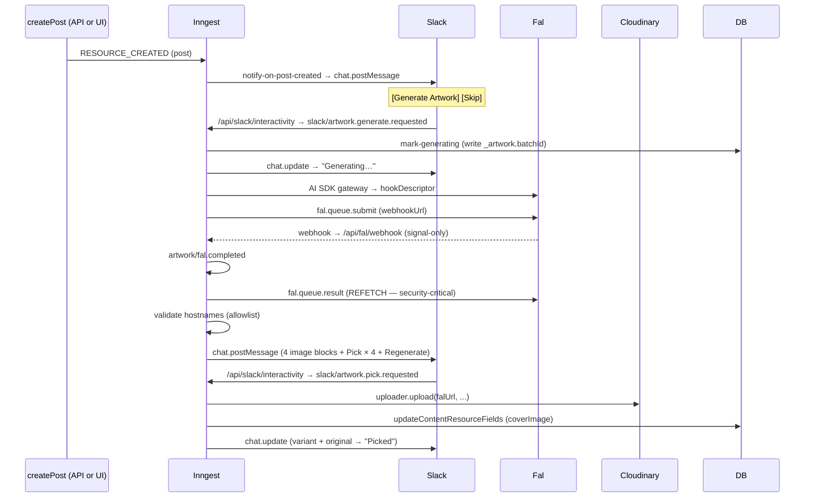

# Post Artwork Generation Flow

Slack-mediated pipeline that turns a newly created post into a cover image. A dedicated content-bot Slack app posts a notification when posts are created; clicking **Generate** triggers a fal LoRA generation, posts 4 variants as a thread reply with full-width image previews, and uploads the picked variant to Cloudinary as `post.fields.coverImage`.

This loop exists so v9 LoRA iteration can happen against real posts without blocking Matt's API publishing flow. Posts ship without a cover by default; coverage is opt-in.

## Triggers

| Surface | Path | Bypasses guards? |
|---------|------|------------------|
| Post creation (API) | `posts.service.createPost` → emits `RESOURCE_CREATED` | no |
| Post creation (admin UI) | `posts-query.createPost` → emits `RESOURCE_CREATED` | no |
| Slack button | `[Generate Artwork]` on the notification | no |
| Slash command | `/artwork <slug-or-url>` in `#content` | yes |
| CLI | `pnpm artwork:replay <slug-or-url>` | yes |

Both create paths emit `RESOURCE_CREATED` with idempotency id `post-created:<id>`, so a single post never produces multiple notifications regardless of which entry point created it.

## Sequence

## Implementation map

| Concern | File |
|---------|------|
| Post schema (`coverImage`, `_artwork`) | `apps/ai-hero/src/lib/posts.ts` |
| Event emission on create | `apps/ai-hero/src/lib/posts/posts.service.ts`, `apps/ai-hero/src/lib/posts-query.ts` |
| Inngest event types | `apps/ai-hero/src/inngest/events/artwork.ts` |
| Slack signature helper | `apps/ai-hero/src/utils/verify-slack-signature.ts` |
| Notify on post creation | `apps/ai-hero/src/inngest/functions/artwork/notify-on-post-created.ts` |
| Slack interactivity webhook | `apps/ai-hero/src/app/api/slack/interactivity/route.ts` |
| Slash command webhook | `apps/ai-hero/src/app/api/slack/commands/route.ts` |
| Generate orchestrator | `apps/ai-hero/src/inngest/functions/artwork/generate-artwork.ts` |
| fal completion webhook | `apps/ai-hero/src/app/api/fal/webhook/route.ts` |
| Pick (Cloudinary upload + cover write) | `apps/ai-hero/src/inngest/functions/artwork/pick-variant.ts` |
| Skip | `apps/ai-hero/src/inngest/functions/artwork/skip-notification.ts` |
| Retry | `apps/ai-hero/src/inngest/functions/artwork/retry-handler.ts` |
| CLI replay | `apps/ai-hero/scripts/artwork-replay.ts` |
| Slug parsing | `apps/ai-hero/src/utils/parse-post-slug.ts` |

## Failure handling

All pipeline failures route through the `artwork/generation.failed` Inngest event. The user-facing surface is a thread reply with a `[🔄 Retry]` button. The post is never partially mutated:

- **fal timeout (>5min)**: failure event fired; original notification updated to "❌ Generation failed".
- **Hostname allowlist rejection**: terminal; no images shown.
- **AI SDK refusal/empty**: hook falls back to `post.fields.title`; pipeline continues.
- **Cloudinary 4xx on Pick**: terminal; failure thread reply with `retryStage: 'pick'`.
- **Cloudinary 5xx**: Inngest retries (default 4×); on terminal exhaustion, failure event.
- **Post deleted mid-flight**: `NonRetriableError`; failure thread reply.

Retry button → `/api/slack/interactivity` → `slack/artwork.retry.requested` → re-fires the original event with `bypassGuards: true`.

## Security

Three webhook surfaces:

1. `/api/slack/interactivity` — verifies against `SLACK_CONTENT_BOT_SIGNING_SECRET`, channel-restricted to `SLACK_CONTENT_CHANNEL_ID`.
2. `/api/slack/commands` — same verification, channel-restricted (issued elsewhere → ephemeral redirect, no event fired).
3. `/api/fal/webhook` — signal-only. Image URLs are NOT trusted from the webhook payload. `generate-artwork` re-fetches from `fal.queue.result(falRequestId)` and validates each URL's hostname against the fal CDN allowlist before any image is rendered or uploaded. A forged or unsigned webhook can at worst cause a no-op cycle; never a malicious URL injection.

The Pick handler trusts the `falUrl` carried in the button payload — but that URL was put there by `generate-artwork` only after passing the hostname allowlist, and the Slack signing-secret verification on the interactivity route ensures the button payload itself is authentic.

## What v1 does not do

- **No image post-processing** (sharp, compositing, smart-crop). Variants are shown in Slack as-is and uploaded to Cloudinary unmodified. Branded OG framing is deferred to a future dynamic OG route on top of `post.fields.coverImage.url`.
- **No upfront Cloudinary uploads.** Variants live on fal's CDN; only the picked variant gets uploaded.
- **No backfill** for existing posts. Use `pnpm artwork:replay` for one-offs.
- **No per-day fal cost cap.** In-flight + concurrency-1 guards prevent runaway loops; explicit budget alarms are deferred.
- **No web UI** for picking — Slack only.
