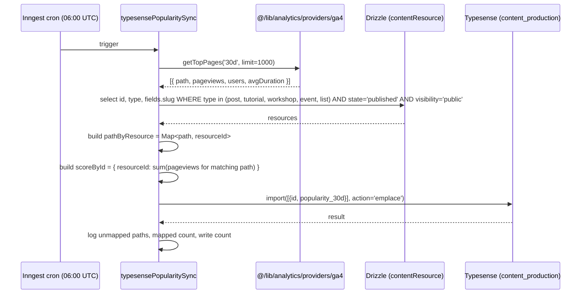

# feat: Typesense popularity sort powered by GA4 pageviews

## Summary

Add a "Most Popular" sort option to the InstantSearch widget on `/posts` (and any other surface that uses the `content_production` Typesense collection) by writing a daily-refreshed `popularity_30d` number — GA4 `screenPageViews` over the last 30 days — into each Typesense document. A new Inngest cron pulls from GA4 once a day and emplaces the field; the sort dropdown gains a new option that points at it.

---

## Problem Frame

`/posts` currently exposes three sort modes (Relevance / Newest / Oldest), backed by `_text_match` and `updated_at_timestamp` in Typesense. Readers have no way to surface content that's actually getting traffic, and editorial decisions about what to feature are not informed by the substantial GA4 data we already have.

The `/api/analytics` endpoint exposes a `traffic/pages` surface that returns GA4 top pages per range (24h, 7d, 30d, 90d). This data is locked behind admin auth and shaped for an admin dashboard / chat agent — nothing makes it available to the public-facing search index.

Goal: bridge the analytics endpoint and the Typesense index so popularity is a queryable, sortable field.

---

## Requirements

- R1. Each public, indexed resource (post, tutorial, workshop, event, list) carries a `popularity_30d: int64` field in its Typesense document. (Schema already altered out-of-band on 2026-05-13 — see Key Decision #7.)
- R2. The field is updated automatically on a daily cadence from GA4 `screenPageViews` for the trailing 30 days.
- R3. Users on `/posts` can pick "Most Popular" from the existing `SortBy` dropdown; the index returns hits sorted by `popularity_30d:desc`.
- R4. Resources with no matching GA4 path do NOT get zeroed out — their previous value is preserved (or they remain unset for brand-new content).
- R5. Re-running the full re-index (`src/scripts/index-content.ts`) must not wipe the popularity field on existing docs.
- R6. The sync job is observable and re-runnable on demand.

---

## Key Technical Decisions

1. **Score = GA4 `screenPageViews` over 30 days. Single `int64` field `popularity_30d`** (Typesense convention for sortable numeric scores per [ranking docs](https://typesense.org/docs/guide/ranking-and-relevance.html); follows the existing `updated_at_timestamp` int64 convention in the collection). Cheapest, most legible, debuggable. Future-proofed by leaving room for additional fields if we ever add `popularity_90d` or a blended score.
2. **"Most Popular" sort uses bucketed text relevance + popularity tiebreaker, not raw popularity.** Per Typesense ranking docs, the recommended pattern for popularity-aware search is `sort_by: '_text_match(buckets: 10):desc, popularity_30d:desc'` — bucket results into 10 equal relevance tiers, then sort by popularity within each tier. With raw `popularity_30d:desc`, a user who types a query AND has Most Popular selected gets the globally-popular post regardless of how well it matches; with bucketed sort, query relevance is preserved and popularity only breaks ties. When there is no query (q='*'), all docs share `_text_match=0`, so bucketed sort and raw popularity sort produce identical results.
3. **Daily refresh via Inngest cron at `TZ=UTC 0 6 * * *`.** Confirmed cadence. 06:00 UTC sits after the existing 04:35 / 05:15 nightly jobs to avoid contention. Inngest gives retries, telemetry middleware, and a manual trigger via event-send out of the box.
4. **Sync job calls `ga4.getTopPages` directly from `@/lib/analytics/providers/ga4`, not over HTTP.** The `/api/analytics` endpoint exists for external/agent consumption and gates on admin auth — pointless for an internal scheduled job. Calling the lib directly is one import and zero round-trips.
5. **Path → resource mapping by `(type, slug)` tuple, keyed by the rendered URL path.** Posts render at `/[slug]` via the `(content)/[post]/page.tsx` catch-all (verified — `/posts/[slug]` only holds `/edit`); workshops at `/workshops/[slug]` AND `/workshops/[slug]/<lesson>` (lesson pageviews rolled up to the parent module via prefix-match — see U3); tutorials at `/tutorials/[module]` AND `/tutorials/[module]/<lesson>` (same rollup); events at `/events/[slug]`; lists at `/lists/[slug]`. We build a `path → resourceId` index from the DB plus a `prefix → resourceId` index for the rollup types, then look up each GA4 row's normalized `path` in both. Collisions (post slug equals workshop slug) are impossible by construction.
6. **Path normalization is mandatory on both sides of the lookup.** GA4 `pagePath` arrives with trailing slashes, query strings, hash fragments, and mixed case in the wild. Apply `normalizePath(p)` (lowercase, strip trailing `/` except for root, drop `?...` and `#...`) to GA4 rows AND to `PATH_BUILDERS` output before insertion into the map. Without this, day-one data is near-empty for most resources.
7. **Schema migrated manually on 2026-05-13 across all environments.** Field added explicitly as `{ name: "popularity_30d", type: "int64", optional: true, facet: false, sort: true }`. The int64 type matches existing sortable timestamp fields (`updated_at_timestamp`, `published_at_timestamp`, `created_at_timestamp`) and `tags.fields.popularity_order: int64[]`. The collection already had a `name: ".*"` wildcard catch-all, so writes for the field always succeeded; the manual alter just promoted it to a sortable index. No code-side migration script is part of this plan.
8. **Partial updates use `action: 'emplace'` with `{ id, popularity_30d }` documents only — nothing else.** Typesense emplace preserves unmentioned fields (per Typesense API docs — "you can send either the whole document or a partial document for update"), so:
   - `updated_at_timestamp`, `created_at_timestamp`, `published_at_timestamp` are untouched by the popularity sync → Newest/Oldest sort orders stay correct.
   - `title`, `description`, `image`, `tags`, `parentResources`, `embedding` (1536-dim vector — re-running would be expensive) all preserved.
   - The DB `contentResource.updatedAt` is also untouched because U4 never writes to the database — it only reads slugs.

   This invariant is enforced by U3's `computePopularityScores` returning exactly `Array<{ id, popularity_30d }>` shape and U3's `writePopularityScores` passing that shape verbatim to `import(..., { action: 'emplace' })`. Both are covered by explicit test scenarios in U3. (R4, R5.)

---

## High-Level Technical Design

> Directional sketch — not implementation. The implementing agent should adapt to actual function signatures and naming conventions in the codebase.



Path-pattern map (single source of truth, kept inside the sync module):

```ts
// directional only
const PATH_BUILDERS: Record<IndexableType, (slug: string) => string> = {
  post: (slug) => `/${slug}`,
  tutorial: (slug) => `/tutorials/${slug}`,
  workshop: (slug) => `/workshops/${slug}`,
  event: (slug) => `/events/${slug}`,
  list: (slug) => `/lists/${slug}`,
}
```

---

## Implementation Units

### ~~U1. Add `popularity_30d` field to the Typesense collection schema~~ — Completed out-of-band on 2026-05-13

The schema was altered manually on Typesense Cloud across all environments before implementation started. The field is live as `{ name: "popularity_30d", type: "int64", optional: true, facet: false, sort: true }`. No code-side action remains for this unit. See Key Technical Decision #7.

(U-ID retained as a stable historical anchor per plan conventions; downstream units that previously listed U1 as a dependency are unchanged, the dependency is just already satisfied.)

---

### U2. Make the shared Typesense schema and indexer aware of `popularity_30d`

**Goal:** Read-side validation accepts the new field, and the full re-index path doesn't accidentally strip it.
**Requirements:** R5.
**Dependencies:** none (schema already altered out-of-band).
**Files:**
- `src/lib/typesense.ts` (extend `TypesenseResourceSchema`)
- `src/lib/typesense-query.ts` (audit `upsertPostToTypeSense` and `indexAllContentToTypeSense` paths)

**Approach:**
- Add `popularity_30d: z.number().int().nonnegative().optional()` to `TypesenseResourceSchema` so any code that reads documents back doesn't fail validation. (Zod's `number()` covers JS-safe int64 range without overflow at our pageview scale.)
- Add a matching entry to `attributeLabelMap`.
- Audit the two writer paths in `typesense-query.ts`: confirm both use `action: 'emplace'` (they already do — lines 247, 446) and that the built document object does NOT include `popularity_30d`, so emplace preserves the field per Typesense docs ("emplace creates a new document or updates an existing document if a document with the same id already exists. You can send either the whole document or a partial document for update").
- **Add a guard test** asserting the document shape produced by both writer paths does NOT include the `popularity_30d` key — `expect(builtDoc).not.toHaveProperty('popularity_30d')`. Cheap regression catch for any future writer that drifts to `upsert` or accidentally passes the wider schema shape through.

**Patterns to follow:** Existing schema definition in `src/lib/typesense.ts`.

**Verification:** Unit test below; `pnpm typecheck` passes.

**Test scenarios:**
- `TypesenseResourceSchema.safeParse({ ...existingValidShape, popularity_30d: 1234 })` succeeds.
- `TypesenseResourceSchema.safeParse({ ...existingValidShape })` (no field) still succeeds.
- `TypesenseResourceSchema.safeParse({ ...existingValidShape, popularity_30d: -5 })` fails.
- `TypesenseResourceSchema.safeParse({ ...existingValidShape, popularity_30d: 'lots' })` fails.

Test file: `src/lib/__tests__/typesense-schema.test.ts` (create if absent; otherwise add to nearest existing test file for `typesense.ts`).

---

### U3. GA4 → Typesense popularity sync helper (pure, testable)

**Goal:** Pull pageviews, map to resources, return the partial-doc batch ready for Typesense — all in plain functions so the Inngest function in U4 is thin.
**Requirements:** R2, R4.
**Dependencies:** U2.
**Files:**
- `src/lib/typesense-popularity.ts` (new)
- `src/lib/__tests__/typesense-popularity.test.ts` (new)

**Approach:**
- The five indexable resource types (`post`, `tutorial`, `workshop`, `event`, `list`) come from `INDEXABLE_TYPES` in `src/scripts/index-content.ts:9` — import that constant rather than re-declaring it, and derive `type IndexableType = (typeof INDEXABLE_TYPES)[number]`. Keeps a single source of truth.
- Export `normalizePath(p: string): string` — lowercase, strip trailing `/` except for root, drop everything from the first `?` or `#`. Apply to both sides of the lookup.
- Export `buildPathIndex(resources)` → `{ exact: Map<string, string>, prefix: Array<{ prefix: string, resourceId: string }> }`. For `post`, `event`, `list`: register exact path `/<slug>` / `/events/<slug>` / `/lists/<slug>`. For `tutorial` and `workshop`: register exact path `/tutorials/<slug>` / `/workshops/<slug>` AND a prefix entry `/tutorials/<slug>/` / `/workshops/<slug>/` so any lesson pageview rolls up to the parent module. Skip resources whose `fields.slug` is missing or whose type isn't in the map.
- Export `computePopularityScores(gaRows, pathIndex)` → `{ scores: Array<{ id, popularity_30d }>, mapped: number, unmappedPaths: string[] }`. For each row: normalize the path, try `pathIndex.exact` first; if no hit, scan `pathIndex.prefix` for a match (longest-prefix wins). Sum pageviews across all matching rows per resource id (covers both the rollup case and any GA4 variant rows that survive normalization).
- Export `fetchIndexablePopularityResources(db)` that selects id/type/fields.slug from `contentResource` filtered to the imported `INDEXABLE_TYPES` constant, with `state='published'` and `visibility='public'`.
- Export `writePopularityScores(client, collection, scores)` that does `import(scores, { action: 'emplace' })` and returns the success/failure count.

**Patterns to follow:**
- Resource selection: `src/scripts/index-content.ts:91–117` (Drizzle pattern).
- Typesense client construction: `src/lib/typesense-query.ts:299–309`.
- Logging: `@/server/logger` with high-cardinality structured fields per global CLAUDE.md guidance.

**Verification:** Unit tests pass; running the helper end-to-end in a manual test against a small set of fixtures produces expected score map.

**Test scenarios:**
- `normalizePath` strips trailing slash (`/foo/` → `/foo`), keeps root (`/` → `/`), drops query (`/foo?ref=x` → `/foo`), drops hash (`/foo#bar` → `/foo`), lowercases (`/Foo` → `/foo`).
- `buildPathIndex` registers a post with slug `foo` as exact `/foo`, a workshop with slug `bar` as exact `/workshops/bar` AND prefix `/workshops/bar/`, a tutorial with slug `baz` as exact `/tutorials/baz` AND prefix `/tutorials/baz/`, an event as exact `/events/<slug>`, a list as exact `/lists/<slug>`.
- `buildPathIndex` returns an empty index when given an empty list.
- `buildPathIndex` skips resources whose `fields.slug` is missing or non-string without throwing.
- `buildPathIndex` skips resources of unknown type (defensive against future schema drift).
- `computePopularityScores` maps a normalized GA4 path through exact lookup first (post `/foo` → post resource).
- `computePopularityScores` falls back to prefix match for workshop lesson paths (`/workshops/bar/lesson-1` → workshop resource with slug `bar`).
- `computePopularityScores` chooses the longest-prefix match when two prefixes both apply (defensive — guards against future nested structures).
- `computePopularityScores` SUMS pageviews when multiple GA4 rows resolve to the same resource id (the rollup case: 5 lessons in workshop `bar`, each with their own pageview count, all sum into one `popularity_30d` for the workshop).
- `computePopularityScores` does NOT include resources with zero matching paths (preserves prior value via emplace — R4).
- `computePopularityScores` records unmapped GA4 paths in `unmappedPaths` for observability.
- `computePopularityScores` returns `{ scores: [], mapped: 0, unmappedPaths: [] }` for an empty GA4 input.
- **Score-shape invariant**: every entry in `scores` has exactly two keys — `id` and `popularity_30d` — and nothing else. Asserted with `Object.keys(score).sort()` deep-equal `['id', 'popularity_30d']` for each row in the returned array. This is the safety check that keeps emplace from accidentally mutating any other field.
- `writePopularityScores` no-ops when `scores` is empty (does not call Typesense).
- `writePopularityScores` passes the scores array verbatim to `client.collections(...).documents().import(scores, { action: 'emplace' })` — no transformation, no field expansion. Tested by mocking the Typesense client and asserting the exact payload passed to `import`.

---

### U4. Inngest scheduled function: daily popularity sync

**Goal:** Wire the helper into a cron-triggered, observable Inngest function and register it.
**Requirements:** R2, R6.
**Dependencies:** U3.
**Files:**
- `src/inngest/functions/typesense-popularity-sync.ts` (new)
- `src/inngest/events/typesense-popularity.ts` (new — manual-trigger event type)
- `src/inngest/inngest.config.ts` (register)

**Approach:**
- `inngest.createFunction({ id: 'typesense-popularity-sync', name: 'Typesense Popularity Sync', concurrency: { limit: 1 } }, [{ cron: 'TZ=UTC 0 6 * * *' }, { event: TYPESENSE_POPULARITY_SYNC_REQUESTED_EVENT }], handler)` — dual trigger so the function can be invoked manually.
- Handler is a sequence of `step.run` calls:
  1. `fetch ga4 top pages` → `ga4.getTopPages('30d', 1000)`.
  2. `load indexable resources` → `fetchIndexablePopularityResources(db)`. **Read-only**: this is a Drizzle `SELECT`, no writes.
  3. `compute popularity scores` → `computePopularityScores(rows, buildPathIndex(resources))`.
  4. `write to typesense` → `writePopularityScores(client, TYPESENSE_COLLECTION_NAME, scores)`.
- Log at the function-handler level: `typesense.popularity.sync.complete` with `{ gaRowCount, mappedCount, unmappedCount, writtenCount, durationMs }`. Use `void log.info(...)`.
- On any step error, let Inngest's retry policy handle it; don't catch.

**Side-effect contract** — explicit so future maintainers don't drift:
- The job does NOT write to the database. Step 2 is a `SELECT` only. The `contentResource.updatedAt` column is never touched.
- The job does NOT call `upsertPostToTypeSense` or `indexAllContentToTypeSense`. It bypasses both writer paths and goes directly through the Typesense client with a minimal `{id, popularity_30d}` emplace.
- The job does NOT trigger Inngest events that would cascade other syncs (e.g., `revalidateTag`, content-cache invalidation). It is a pure analytics → search-index pipeline.
- The job does NOT generate or alter Typesense embeddings (the 1536-dim `embedding` field is preserved by emplace).

**Patterns to follow:**
- Function shape: `src/inngest/functions/ai-coding-dictionary-index.ts` (esp. `step.run` boundaries and return shape).
- Cron syntax: `src/inngest/functions/content-read-retention.ts:11` (`cron: 'TZ=UTC 35 4 * * *'`).
- Concurrency: `aiCodingDictionaryIndex` uses `concurrency: { limit: 1 }` — apply here too.
- Event registration: add the imported function to the `functions` array in `inngest.config.ts`.

**Verification:** `pnpm typecheck` passes; in dev, firing the manual event from the Inngest dashboard runs the job end-to-end against the dev Typesense collection and produces a populated `popularity_30d` for at least one document.

**Test scenarios:** none at this layer — the function is choreography over the unit-tested helper from U3. If we wanted defensive coverage, we'd mock Inngest's `step.run`, which buys little since the helper already has full coverage.

---

### U5. Add "Most Popular" sort option to the InstantSearch SortBy dropdown

**Goal:** Make the new field user-visible.
**Requirements:** R3.
**Dependencies:** U4 (data populated). Schema field is already live.
**Files:**
- `src/app/(search)/q/_components/instantsearch/sort-by.tsx`

**Approach:**
- Add a new entry to `sortOptions` using the **bucketed relevance + popularity tiebreaker** pattern per Typesense ranking docs:
  ```ts
  // directional
  {
    value: `${TYPESENSE_COLLECTION_NAME}/sort/_text_match(buckets:10):desc,popularity_30d:desc`,
    label: 'Most Popular',
  }
  ```
  This sends `sort_by=_text_match(buckets:10):desc,popularity_30d:desc` to Typesense via the InstantSearch adapter's `/sort/` convention. With a query, results are bucketed into 10 relevance tiers and popularity orders within each tier. With no query (q='*'), all docs share `_text_match=0`, so popularity dominates — the same shape a naive user expects.
- **Verify the adapter passes the multi-segment sort string through unchanged.** The `typesense-instantsearch-adapter` parses everything after the first `/sort/` as the literal `sort_by` value, so commas and parens should round-trip. Spot-check in dev tools as part of U5 verification.
- **Normalize all four sort labels to one register** (per design-review feedback) — current options mix verb-phrase ("Sort by Relevance"), noun-phrase ("Newest First"), and adjective-phrase. Recommend noun phrases: "Relevance", "Newest", "Oldest", "Most Popular".
- Place "Most Popular" second in the array (after Relevance, before Newest/Oldest) so it reads as the primary content-discovery alternative.
- Keep Relevance as the default. No other UI changes; the popover already handles arbitrary option counts.
- **Recommended deploy order:** Schema is already live (U1 done out-of-band 2026-05-13). Deploy U4 first, trigger a manual sync, then deploy U5. This guarantees users see a populated sort the moment "Most Popular" becomes available.

**Patterns to follow:** Existing `sortOptions` in the same file.

**Verification:** Dev server running, browse `/posts`, switch sort to "Most Popular", confirm the network tab shows `sort_by=popularity_30d:desc` going to Typesense and that results reorder visibly. Test both light and dark mode (per `apps/ai-hero/AGENTS.md`).

**Test scenarios:**
- `sortOptions` array contains exactly four entries with the new "Most Popular" option present and shaped `${TYPESENSE_COLLECTION_NAME}/sort/popularity_30d:desc`.

Test file: `src/app/(search)/q/_components/instantsearch/__tests__/sort-by.test.ts` (create if absent — small focused test against the exported `sortOptions` constant; the component itself is small enough to skip rendering tests).

---

### U6. Operational runbook entry

**Goal:** Document how to migrate the schema and trigger a manual run so on-call doesn't have to spelunk through code.
**Requirements:** R6.
**Dependencies:** U4.
**Files:**
- `docs/observability/typesense-popularity-sync.md` (new, short)

**Approach:** Half a page covering:
- Schema field is already live across environments (migrated 2026-05-13); no migration step. If a brand-new env is provisioned later, add the field manually on the Typesense Cloud cluster as `{ name: "popularity_30d", type: "int64", optional: true, facet: false, sort: true }`.
- How to fire a manual sync: send the `TYPESENSE_POPULARITY_SYNC_REQUESTED_EVENT` via the Inngest dev UI or `inngest.send`.
- Where to look in Axiom: filter on `typesense.popularity.sync.*`.
- Failure modes: GA4 quota exhaustion (rare), Typesense write API key missing (logs `typesense.upsert.config-missing`-style line).

**Verification:** Run through the runbook once on staging.

**Test expectation:** none — documentation.

---

## System-Wide Impact

- **Typesense collection schema change** on `content_production` (managed in Typesense Cloud). All apps that read from this collection — `apps/ai-hero` is the primary one — must tolerate the new optional field. The shared `TypesenseResourceSchema` in `src/lib/typesense.ts` is the gate. Other apps (`apps/egghead`, `apps/dev-build`) have their own Typesense schemas and collections; this change does not touch them.
- **GA4 quota**: one `getTopPages` call per day. Negligible — the admin dashboard already issues this query interactively.
- **Inngest function count**: +1 scheduled function. Below any practical limit.
- **InstantSearch UX**: one new sort option visible on every page that uses `<Search />` (currently `/posts` and `/q`).

---

## Risk Analysis & Mitigation

| Risk | Likelihood | Impact | Mitigation |
|---|---|---|---|
| GA4 `pagePath` variants (trailing slash, query string, hash, case) miss the path index | High (default behavior) | High — day-one near-empty popularity | `normalizePath(p)` applied to both sides of the lookup (Key Decision #6, U3). Log `unmappedPaths` so any residual mismatch shows up in Axiom on day one. |
| `getTopPages` returns top-N globally and the long tail of indexable resources falls below the limit | Medium | Medium — middle-tier resources never get a score | First pass: bump `limit` to 1000 and measure `unmappedPaths` vs `mapped` ratio. If long-tail loss is meaningful, extend the GA4 provider to accept a `pagePath BEGINS_WITH` dimension filter scoped to `/`, `/workshops/`, `/tutorials/`, `/events/`, `/lists/`. Tracked as deferred follow-up. |
| Cold-start window: U5 ships before U4 has populated values, "Most Popular" returns meaningless ordering | Low | Low | Schema is already live, so the recommended deploy order is U4 (with one manual sync trigger) → U5. Operator runbook in U6 covers the manual trigger. |
| Schema drift if a new environment is provisioned later without the field | Low (new envs are rare) | High if it happens (sort silently broken) | U6 runbook explicitly lists the field spec for fresh-environment setup. |
| Workshop / tutorial popularity excludes lesson-page traffic | Was: Certain. Now: mitigated. | Was: High. Now: low. | Lesson rollup via `prefix → resourceId` index (U3 Approach). `computePopularityScores` test scenarios specifically cover the rollup case. |
| New resource has no pageviews and sorts to the bottom | Certain | Low | Expected behavior. Relevance/Newest sorts remain the primary discovery modes. |
| Cron overlaps with another nightly job and exhausts the function quota | Low | Low | 06:00 UTC chosen to sit after existing 04:35 / 05:15 jobs; `concurrency: { limit: 1 }` prevents pile-up. |
| Re-index (`index-content.ts`) wipes popularity | Low (we use emplace) | High if it happens | U2 audits both writers AND adds a regression test (`expect(builtDoc).not.toHaveProperty('popularity_30d')`) catching future drift to `upsert` or stripping via Zod parse. |
| GA4 credentials missing in some environment | Medium (already a pattern) | Medium | `getTopPages` will throw → Inngest step retries → eventual failure logs. Step name (`fetch ga4 top pages`) makes the failure cause obvious in Inngest UI. |
| User searches with "Most Popular" selected and gets results that don't match their query | Was: Certain with raw `popularity_30d:desc`. Now: mitigated. | Was: High. Now: none. | Bucketed sort `_text_match(buckets:10):desc, popularity_30d:desc` (Key Decision #2). Relevance is preserved; popularity orders within each bucket. |

---

## Dependencies / Prerequisites

- Typesense write API key (`TYPESENSE_WRITE_API_KEY`) available in the environment running the sync job. Already required by `src/lib/typesense-query.ts`.
- GA4 credentials (`STATS_ANALYTICS_PROPERTY_ID`, `GOOGLE_ANALYTICS_CLIENT_EMAIL`, `GOOGLE_ANALYTICS_PRIVATE_KEY`). Already required.
- Inngest cron triggers active in production (they are — see `vercel.json` cron + `inngest.config.ts`).

No new env vars, no new packages.

---

## Scope Boundaries

### Deferred to follow-up work

- Make "Most Popular" the default sort on `/posts` (current default stays Relevance; a small UX experiment is worth its own decision).
- Expose `popularity_30d` numerically in the post card UI (would need design input on whether view counts are a vibe we want to show).
- Surface the GA4 last-sync timestamp on an admin dashboard.
- Per-type popularity sort presets (e.g., "Popular workshops only").

### Outside scope

- Blended scoring (pageviews + completions + purchase correlation) — explicitly declined in scope confirmation.
- Multiple popularity windows (`popularity_90d` etc.) — explicitly declined.
- Backfill of historical daily popularity time-series.
- Per-segment popularity (anonymous vs subscribers).
