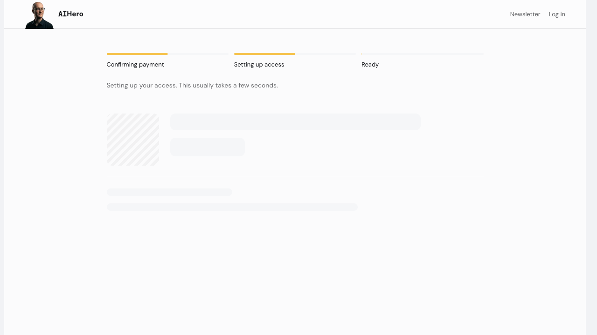
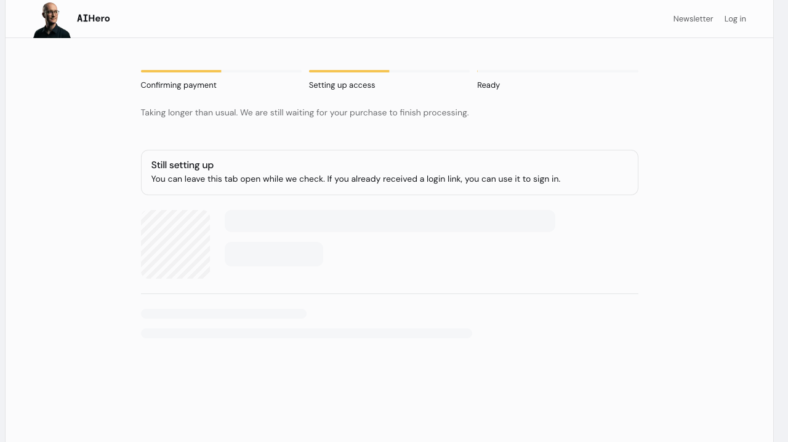
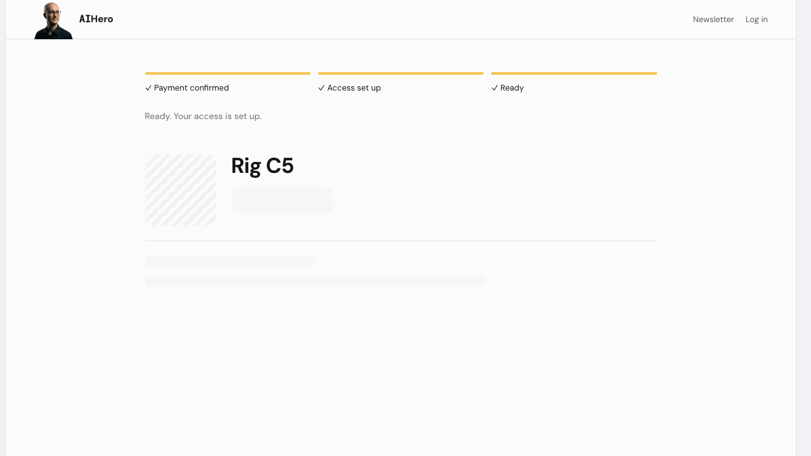
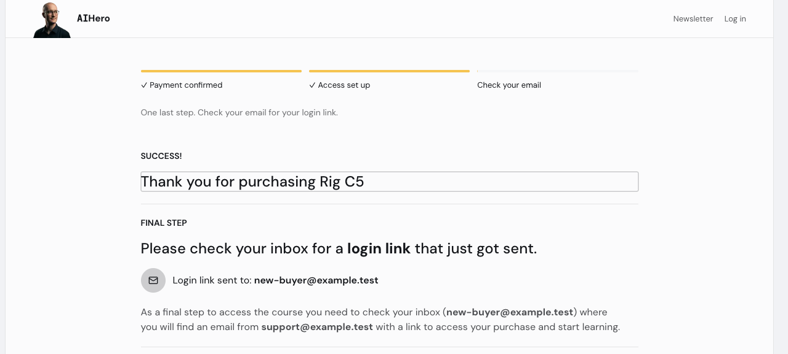
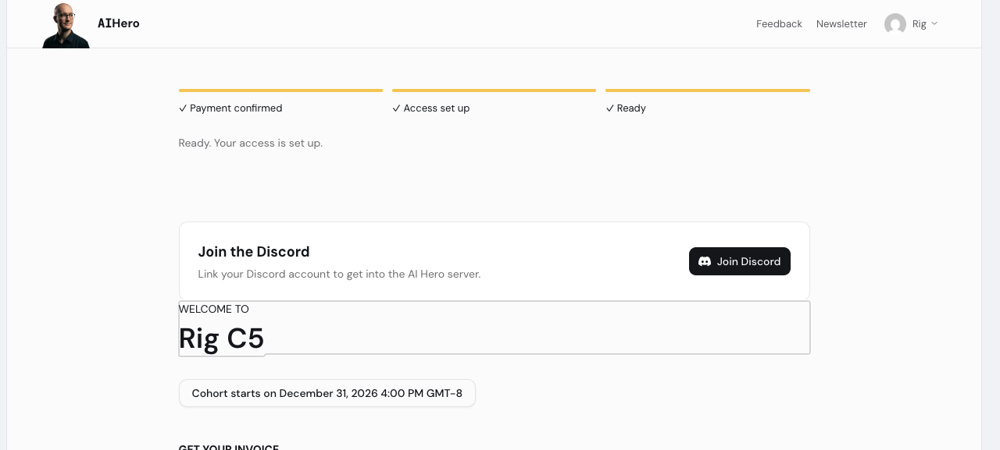
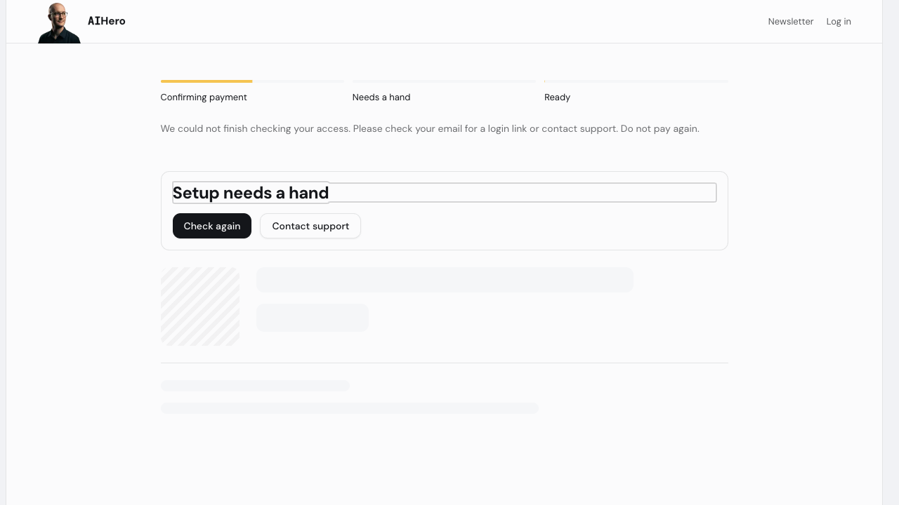
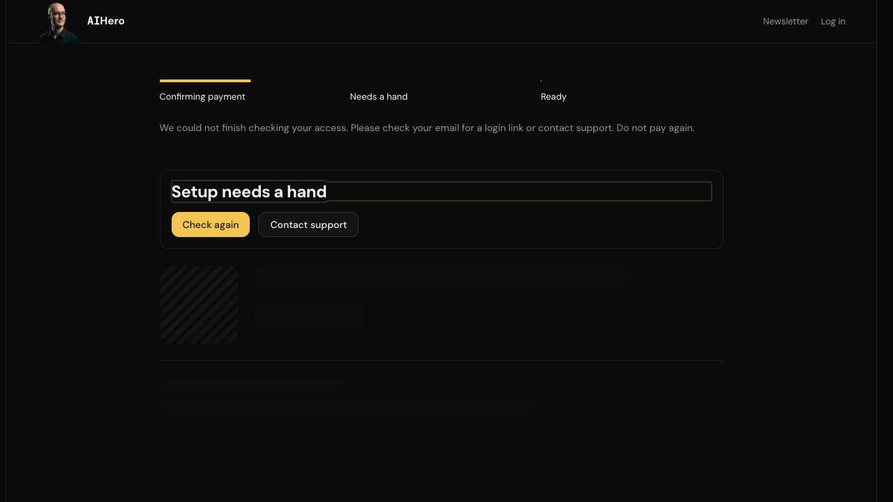
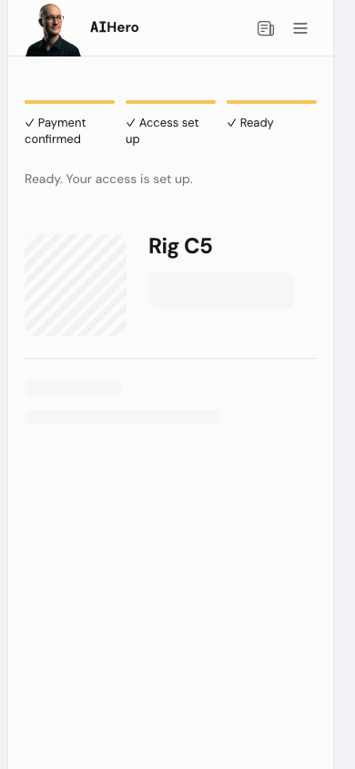

# Post-purchase waiting flow

The thank-you page, server loading states, login-link handoff and welcome page now use the same shell. It reuses the app's tokens and Course Builder Progress, Skeleton, Alert and Button components.

The waiting lifecycle is `checking.polling → checking.waiting → checking.polling`, then `ready` or `failed`. Slow copy appears after 10 seconds. The 90-second deadline also cancels a stalled request. Retry starts a fresh deadline. Failure stops the skeleton animation and focuses the support heading. Completion focuses the real destination heading. Reduced-motion preferences disable animation and the short cross-fade delay.

## Three regression fixes

- Timeout no longer leaves a spinner beside the error. The failed shell has static placeholders, retry and support actions.
- Removed `payment_succeeded_processing_failed` from the polling contract. A database miss does not prove a Stripe payment failed. The status route stays database-only; the server's separate Stripe-evidence fallback remains.
- A post-retry purchase miss now returns a support state, not a 404. Malformed session IDs still return 404. Copy says payment is confirmed only after purchase or Stripe evidence exists.

## Navigation and telemetry

Hard navigation remains. A signed-out purchase visitor needs the login-link branch; client navigation directly to welcome must not bypass session and ownership checks. The new-account session-cookie risk is not cleared for soft navigation.

The four telemetry call sites match `createBuyPathLogger(checkoutSessionId)`: an emitter takes `client_returned`, `client_polling`, `purchase_visible` or `destination_rendered`, plus optional `attempt`, `durationMs` and `outcome` (`ok`, `failed` or `skipped`). The adapter now directly exports the shared factory. This change creates neither its own logger nor its own identifier, timing or transport.

The checkout-session key travels to welcome as telemetry-only `buyPathId`, not `session_id`, so it does not trigger another Stripe lookup or grant access. The waited marker prevents the destination from repeating the two observations already emitted by a mounted poller. Fast purchases that never mount the poller record those observations on destination mount. Welcome uses the shared purchase-context reader as a fallback when no correlation key arrives. The destination emits through the same shared helper, not a second beacon.

## Verification

The earlier standalone change passed typecheck, changed-file ESLint and 34 relevant Vitest tests. After integrating the final shared-telemetry candidate `e36f33361112d59a5aed734fb8f920f7ed23d718`, full typecheck, changed-file ESLint and 76 tests across 16 suites passed. These include the mounted pricing tests and transport-failure tests. The shared helper contains synchronous throws and asynchronous rejections; the waiting adapter exports that same guarded factory. Browser checks found no accessibility violations in the failed shell or welcome section. The mobile ready-shell preview had no horizontal overflow. Reduced-motion and failure frames had no active skeleton animations.

Before updating the branch base, the sandbox checkout CLI's hosted-card automation failed. The same hosted test checkout was completed with agent-browser instead. Independent commerce-rig `provesAccess` readback confirmed a paid test session, stored webhook, matching purchase and entitlement. The signed-out browser reached the login-link shell. A synthetic authenticated session reached welcome and focused its heading.

The combined candidate includes main through #398 and the final agreed #392 candidate. The paid runs below used the earlier shared candidate `fc0c5d75`; the final merge changed shared telemetry and its tests, not the waiting UI. No new paid run was required. The configured sandbox flag fixture now permits checkout without weakening the gate. Authenticated `checkout new-buyer --complete` passed with a paid test session, webhook, matching C5 purchase/entitlement and accepted destination telemetry. An authenticated browser reread reached welcome and focused its heading.

The separate signed-out browser created a fresh synthetic account. Because outbound mail is fenced, the test seeded a verification token, then used the real confirmation endpoint to obtain the app-issued session cookie. An initial callback-decoding mistake in the test fixture was corrected; it was not an application authentication bug.

That browser completed a second hosted test checkout with agent-browser. Independent readback confirmed its paid session, webhook, matching C5 purchase and entitlement. However, login and payment return used different loopback hostnames. The real cookie still resolved the new account on the login host, but the return had no session and showed the focused login-link handoff instead of welcome. The experimental same-document ready transition ran, but the new-account cookie gate did not clear. The final branch therefore retains hard navigation. No cookie was copied between hosts and no gate was relaxed. Follow-up: align the rig login and checkout-return origins, then prove the soft new-account handoff. This rig-only origin split is not a release gate for the retained hard navigation.

All screenshots use synthetic data. No production checkout, provider configuration or database writes were performed. Development toolbars are hidden in the screenshots; app content is unchanged.

## Frames

### Processing

### Slow processing

### Ready to navigate, component preview

This frame mounts the real shell with synthetic ready-state props. It is a UI preview, not a checkout or entitlement proof.

### Login-link handoff, signed out

### Welcome, authenticated

### Failed check, with focus and support actions

This is the actual 90-second timeout on a synthetic missing checkout session, not a forced error prop.

### Dark theme, failed check

### Mobile ready-shell preview

